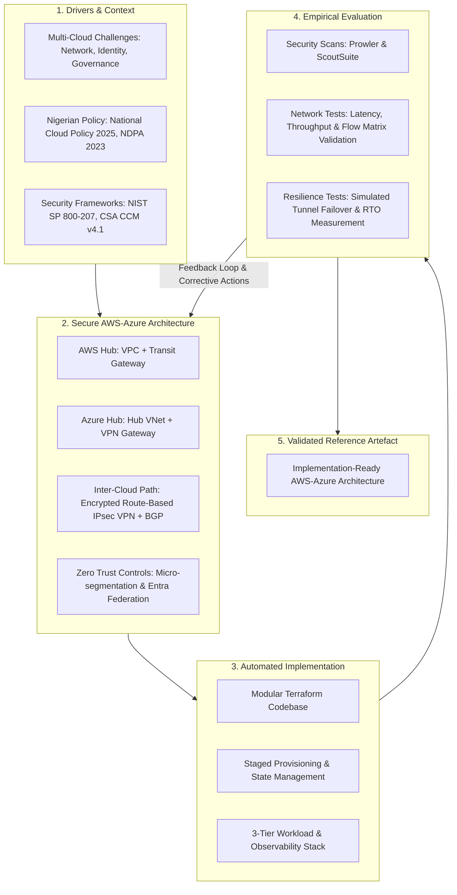
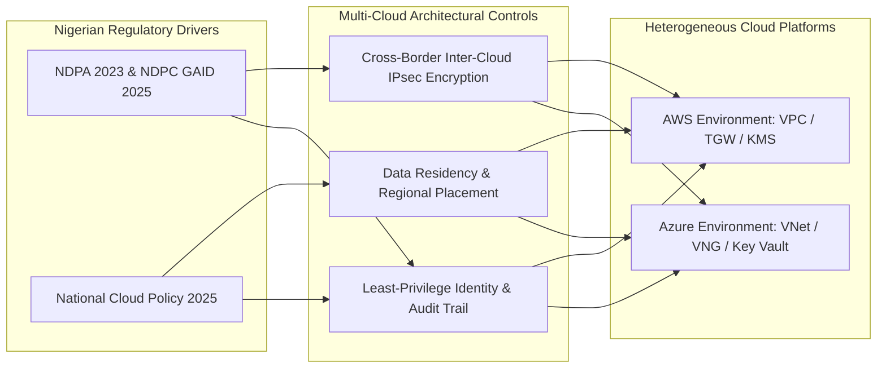
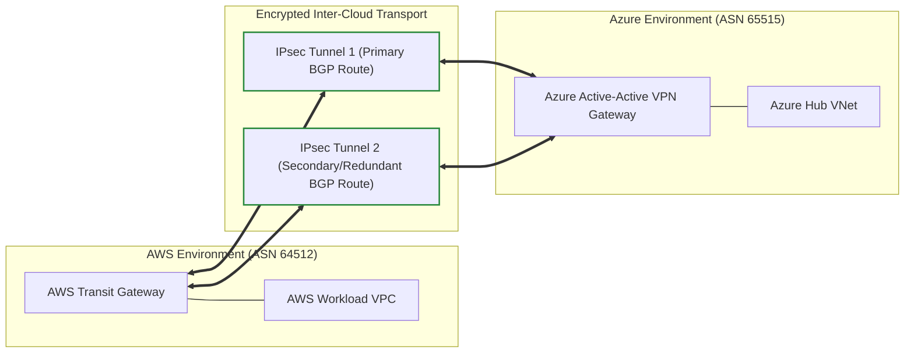
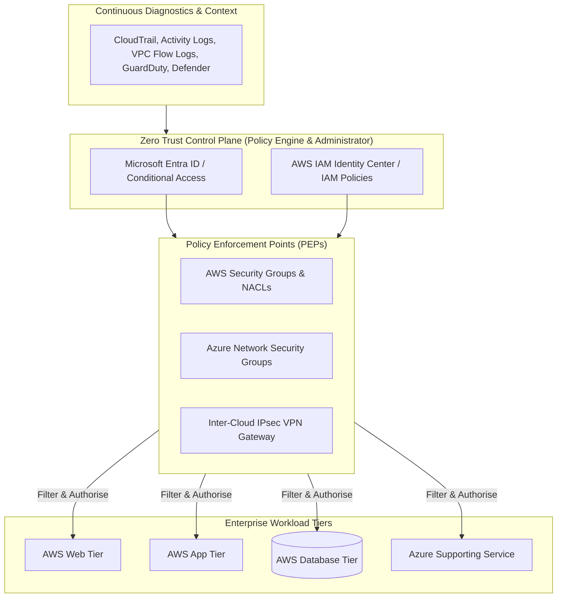
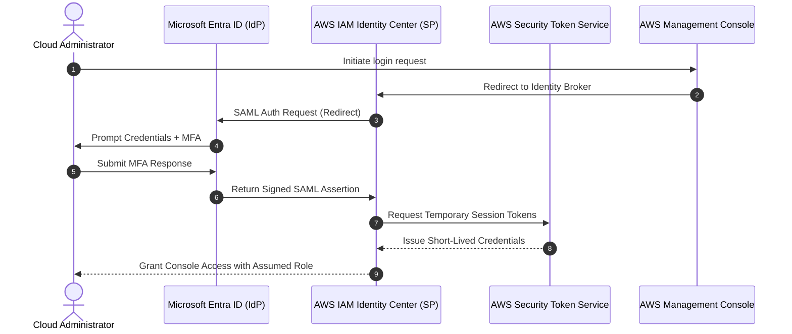
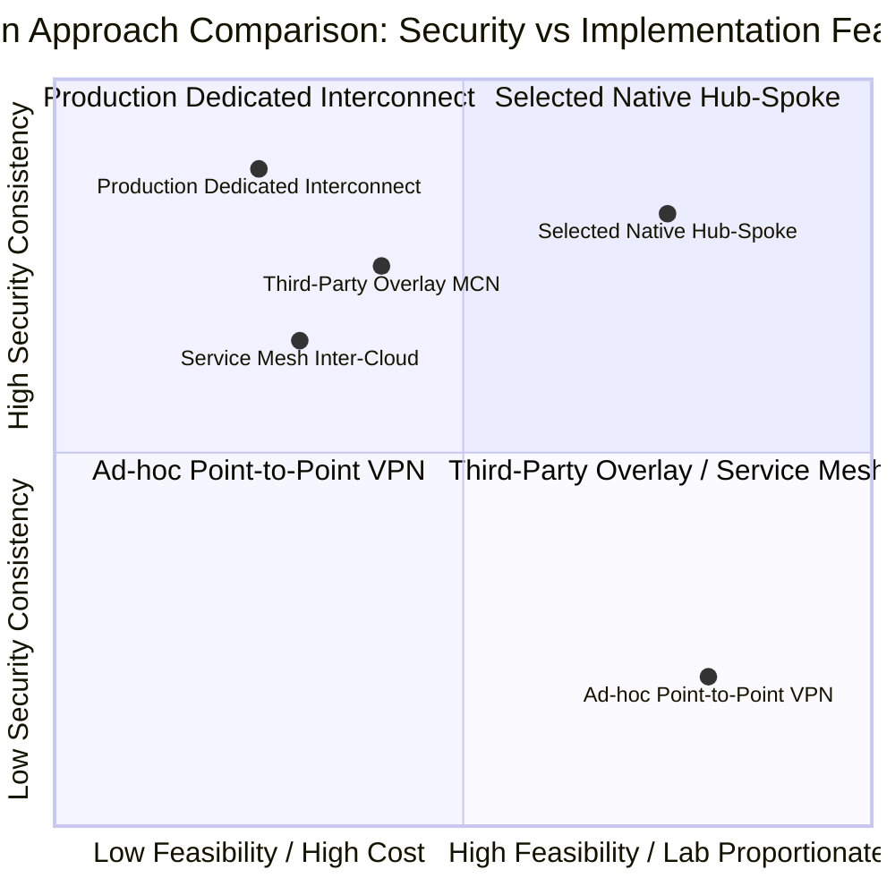

# CHAPTER ONE: INTRODUCTION

## 1.0 Introduction

Cloud computing has become a central component of contemporary enterprise information technology. Organisations increasingly depend on public cloud platforms to host applications, store information, analyse data, support remote access, and provide digital services to customers. In sectors such as financial services, telecommunications, healthcare, government, and electronic commerce, cloud infrastructure is no longer used only for secondary systems. It now supports customer-facing applications, identity services, business intelligence, backup environments, disaster recovery facilities, and other workloads that are critical to organisational continuity.

The growing importance of cloud services has changed how enterprises design their technology environments. Rather than placing all workloads with a single cloud service provider, organisations frequently distribute applications and supporting services across two or more cloud platforms—a arrangement commonly described as a multi-cloud architecture. A multi-cloud strategy enables an organisation to leverage specialised capabilities of different providers, reduce excessive vendor lock-in, improve service continuity, and satisfy operational or regulatory requirements. However, it also introduces complex security and architectural challenges regarding inter-cloud network connectivity, identity management, security-policy consistency, monitoring, incident detection, and regulatory governance.

This Professional Master’s Project addresses these challenges through the design, implementation, and empirical evaluation of a secure reference architecture connecting Amazon Web Services (AWS) and Microsoft Azure. The project is deliberately practice-oriented and solution-driven. It moves beyond theoretical discussions of multi-cloud security by developing a deployable, reproducible technical artefact comprising segmented cloud networks, encrypted inter-cloud connectivity, federated identity controls, centralised observability, Infrastructure as Code (IaC), and a representative three-tier enterprise workload. The resulting system is evaluated against quantitative security posture, network performance, and operational resilience criteria.

This orientation aligns directly with the MIVA Open University Professional Master’s Project framework, which requires an applied, solution-driven project demonstrating the ability to identify a real-world IT problem, design and implement a practical solution, and evaluate the system under empirical conditions.

---

## 1.1 Background to the Project

### 1.1.1 Evolution of Enterprise Cloud Computing
Cloud computing is defined by the National Institute of Standards and Technology (NIST) as a model for enabling convenient, on-demand network access to a shared pool of configurable computing resources (Mell & Grance, 2011). Key characteristics include on-demand self-service, broad network access, resource pooling, rapid elasticity, and measured service. Service models span Infrastructure as a Service (IaaS), Platform as a Service (PaaS), and Software as a Service (SaaS), deployed across public, private, community, or hybrid environments.

The strategic attraction of cloud computing lies in decoupling computing capacity from physical infrastructure ownership. Compute, storage, network, and security services can be provisioned through automated APIs rather than lengthy physical procurement processes. This shortens time-to-market, supports geographically distributed operations, and enforces configuration consistency across development, testing, and production environments.

However, cloud migration alters the distribution of security responsibilities. Under the shared-responsibility model, cloud providers secure the underlying physical facilities and managed infrastructure, while customers retain responsibility for user access, workload configuration, data classification, network filtering, and application security. Misunderstanding this boundary often leads to critical control failures, even on underlying infrastructure that is technically secure.

### 1.1.2 Emergence of Multi-Cloud Enterprise Environments
A multi-cloud environment exists when an organisation deliberately consumes public cloud services from more than one provider. This ranges from loosely coupled deployments (e.g., primary applications in AWS with backup in Azure) to tightly integrated architectures where identity, application processing, data storage, and disaster recovery services communicate continuously across platforms.

Motivations for multi-cloud adoption include:
1. **Avoiding Vendor Lock-in**: Mitigating commercial dependency and operational risk associated with single-provider disruptions.
2. **Accessing Specialised Services**: Exploiting differentiated capabilities, such as AWS for scalable compute or Azure for Microsoft Entra ID governance.
3. **Enhancing Resilience**: Creating multi-provider disaster recovery pathways. However, resilience is not automatic; single points of failure (e.g., a single DNS provider, unredundant VPN tunnel, or single identity broker) can compromise the entire topology.
4. **Regulatory and Data Sovereignty Compliance**: Meeting jurisdiction-specific data residency requirements.

In Nigeria, this context is shaped by the **National Cloud Policy 2025** (National Information Technology Development Agency [NITDA], 2025), which mandates a "Cloud First" direction while emphasising data classification, sovereignty, and secure local data residency. Concurrently, the **Nigeria Data Protection Act (NDPA) 2023** (Federal Republic of Nigeria, 2023) and the **NDPC General Application and Implementation Directive (GAID) 2025** establish strict legal accountability for personal data processing, cross-border data transfers, and security controls. Cross-cloud data movement must therefore be governed by clear legal, policy, and technical safeguards.

### 1.1.3 AWS and Microsoft Azure as Enterprise Cloud Platforms
AWS and Microsoft Azure dominate the public cloud market, offering mature IaaS and PaaS capabilities, but their resource models and administrative abstractions differ significantly:
- **AWS Environment**: Workloads operate within Amazon Virtual Private Clouds (VPCs). Traffic filtering uses stateful Security Groups and stateless Network Access Control Lists (NACLs). Identity is managed via AWS IAM and IAM Identity Center. Centralised routing across VPCs and external networks is provided by **AWS Transit Gateway**, while encrypted inter-cloud connectivity terminates on **AWS Site-to-Site VPN**.
- **Microsoft Azure Environment**: Workloads operate within Azure Virtual Networks (VNets). Traffic filtering relies on Network Security Groups (NSGs) and Azure Firewall. Identity is centered around **Microsoft Entra ID**. Centralised networking uses Hub-and-Spoke VNets or Azure Virtual WAN, with encrypted connectivity managed by **Azure VPN Gateway**.

Because these platforms use different naming conventions, rule processing engines, and logging schemas, establishing a secure multi-cloud architecture requires functional synthesis rather than literal rule mirroring.

### 1.1.4 Enterprise Workload Context
To demonstrate and evaluate the architecture, this project employs a representative three-tier enterprise workload:
1. **Presentation (Web) Tier**: Receives user requests via an approved public entry point (Application Load Balancer / Nginx reverse proxy).
2. **Application Tier**: Processes business logic and manages inter-cloud API communications.
3. **Data Tier**: Stores persistent enterprise data (PostgreSQL database).

Security segmentation dictates that external users communicate only with the web tier, the web tier communicates exclusively with the application tier on specific ports, and the database is accessible solely from the application tier. The database is strictly isolated from direct public Internet access and unapproved cross-cloud segments.

### 1.1.5 Security Implications of Multi-Cloud Connectivity
The primary security challenge in multi-cloud networking is that inter-cloud tunnels (such as IPsec VPNs) establish IP reachability without enforcing application-level authorisation. Overly permissive routing or security rules allow compromised workloads in one cloud to scan or move laterally into another. Furthermore, fragmented identity platforms create credential duplication and privilege sprawl, while disparate logging formats impede cross-cloud threat visibility and incident reconstruction.

These vulnerabilities support adopting **Zero Trust Architecture** principles (NIST SP 800-207; Rose et al., 2020; NIST SP 800-207A; Chandramouli & Butcher, 2023). Zero Trust removes implicit trust based on network location, requiring explicit authentication, continuous policy evaluation, and micro-segmentation for every access request.

### 1.1.6 Infrastructure as Code and Reproducibility
Manual portal configuration in multi-cloud environments causes configuration drift, undocumented firewall exceptions, and non-reproducible deployments. Infrastructure as Code (IaC) resolves these issues by defining cloud infrastructure in declarative, version-controlled scripts. **Terraform by HashiCorp** is selected for this project because its provider ecosystem allows AWS and Azure resources to be orchestrated within a unified codebase.

### 1.1.7 Need for an Implemented and Evaluated Reference Architecture
While vendor documentation provides guidance for individual AWS or Azure products, vendor materials rarely offer an independent academic evaluation of an integrated, multi-provider architecture. Similarly, Zero Trust literature describes abstract principles but lacks concrete, reproducible implementation guides for combined AWS–Azure deployments. This project bridges that gap by providing a lab-scale, fully codified, and empirically evaluated AWS–Azure reference architecture.

---

## 1.2 Conceptual Foundation of the Project

The conceptual framework connects five core elements: Enterprise Requirements, Security & Regulatory Drivers, System Architecture, Automated Implementation, and Empirical Evaluation.

**Figure 1.1: Conceptual Framework for the Secure AWS–Azure Multi-Cloud Project**

The iterative feedback loop ensures that initial design flaws (such as permissive routes or failover bottlenecks identified during testing) lead to code refinement and redeployment, reflecting Design Science Research Methodology (DSRM).

---

## 1.3 Statement of the Problem

Enterprises deploying AWS and Azure concurrently often establish inter-cloud connectivity incrementally to satisfy immediate operational demands. Over time, this ad-hoc expansion results in:
1. **Inconsistent Security-Policy Enforcement**: Equivalent security intent (e.g., blocking web-to-database access) is configured inconsistently across AWS Security Groups and Azure NSGs.
2. **Fragmented Identity Management**: Duplicate user accounts, static credentials, and uncoordinated role permissions lead to excessive administrative privileges and audit gaps.
3. **Unrestricted Network Reachability and Expanded Attack Surface**: IPsec VPNs establish broad IP routing between cloud environments without enforcing explicit application-level or tier-level micro-segmentation, creating paths for lateral movement.
4. **Dispersed Monitoring and Low Visibility**: Telemetry remains trapped in separate native portals (CloudWatch/CloudTrail vs. Azure Monitor/Log Analytics), delaying cross-cloud detection and response.
5. **Unverified Resilience**: High availability is assumed based on the presence of two cloud providers, but path failover and Recovery Time Objectives (RTO) are rarely tested empirically under failure conditions.
6. **Regulatory Compliance Uncertainty**: In the Nigerian context, ungoverned inter-cloud data flows make it difficult to demonstrate compliance with the National Cloud Policy 2025 and NDPA 2023 cross-border data protection mandates.

**The specific problem addressed by this project** is the lack of a practical, reproducible, and empirically evaluated AWS–Azure reference architecture that integrates encrypted inter-cloud networking, workload segmentation, federated identity, centralised observability, and Infrastructure as Code for a representative enterprise workload.

---

## 1.4 Aim and Objectives of the Project

### 1.4.1 Aim
The aim of this project is to **design, implement, and evaluate a secure, resilient, and compliant AWS–Azure multi-cloud architecture for a representative enterprise workload using Zero Trust principles, defence-in-depth security, and Infrastructure as Code**.

### 1.4.2 Objectives
1. **To critically review** relevant multi-cloud architectures, interconnection strategies, Zero Trust frameworks (NIST SP 800-207/207A, CSA CCM v4.1), and Nigerian regulatory standards (NDPA 2023, National Cloud Policy 2025) to establish the technical gap.
2. **To design** a secure hub-and-spoke AWS–Azure architecture incorporating network segmentation, encrypted inter-cloud connectivity, federated identity controls, and centralised observability for a representative three-tier workload.
3. **To implement** the proposed architecture using modular, parameterised Terraform Infrastructure as Code across AWS and Azure.
4. **To configure and validate** Zero Trust and defence-in-depth security controls, including deny-by-default traffic rules, least-privilege identity roles, storage/transit encryption, and central audit logging.
5. **To empirically test and evaluate** the implemented architecture using automated configuration scanning (Prowler, ScoutSuite), network performance testing (ping, iperf3), and controlled connectivity failover simulation.

---

## 1.5 Scope of the Project

- **Technical Scope**: Focuses on AWS and Microsoft Azure IaaS/PaaS networking, AWS Transit Gateway, AWS Site-to-Site VPN, Azure VPN Gateway, route-based IPsec with BGP, Microsoft Entra ID to AWS IAM Identity Center federation, AWS KMS/Azure Key Vault, and logging services.
- **Workload Scope**: A proof-of-concept three-tier application (Nginx web reverse proxy, Python Flask application tier, PostgreSQL database tier) using synthetic data.
- **Security-Testing Scope**: Configuration scanning using Prowler and ScoutSuite, manual port/path validation, and identity permission verification. Excludes destructive exploitation or third-party penetration testing.
- **Performance and Resilience Scope**: Inter-cloud round-trip latency (ping), TCP throughput (iperf3), and measured failover recovery time (RTO) during simulated tunnel failure.
- **Regulatory Scope**: Architectural alignment with the Nigeria Data Protection Act 2023 and National Cloud Policy 2025.
- **Exclusions**: Integration with GCP or Oracle Cloud, dedicated physical circuits (Direct Connect/ExpressRoute), enterprise SIEM/SOAR platforms, and full production application penetration testing.

---

## 1.6 Significance of the Project

- **To Enterprise Organisations**: Provides an actionable, blueprinted reference architecture for securely connecting AWS and Azure workloads.
- **To the Nigerian Context**: Demonstrates how local regulatory requirements (NDPA 2023, National Cloud Policy 2025) can be translated into technical configurations (route tables, encryption keys, RBAC roles).
- **To Cybersecurity & Cloud Architecture Practice**: Operationalises Zero Trust principles across multi-cloud boundaries and documents provider-to-provider control mappings.
- **To IaC Practice**: Delivers modular, reusable Terraform code demonstrating cross-provider dependency handling and state security.

---

## 1.7 Organisation of the Report

- **Chapter One**: Introduction, Background, Problem Statement, Aim/Objectives, Scope, and Significance.
- **Chapter Two**: Literature Review, Technology Context, Critical Analysis, and Gap Analysis.
- **Chapter Three**: Methodology (Design Science Research), System Design, Architecture, Network/Identity/Security Models, and Test Design.
- **Chapter Four**: System Implementation, Environment Setup, Terraform Code Listings, and Operational Workflows.
- **Chapter Five**: Testing, Results, and Empirical Evaluation (Security, Performance, Resilience, and Objective Assessment).
- **Chapter Six**: Summary, Conclusions, Professional Contributions, and Practical Recommendations.

---

# CHAPTER TWO: LITERATURE REVIEW AND TECHNOLOGY CONTEXT

## 2.0 Introduction

This chapter critically reviews the theoretical foundations, architectural concepts, platform technologies, security frameworks, and empirical literature relevant to multi-cloud integration between Amazon Web Services (AWS) and Microsoft Azure. In accordance with the MIVA Open University Professional Master’s Project guidelines, this review goes beyond describing cloud technologies; it critically evaluates existing solution patterns, analyzes technological trade-offs, weaves regulatory requirements into technical domains, and defines the research gap addressed by the implemented artefact.

The chapter is organized into thirteen structured sections covering conceptual foundations, theoretical frameworks, provider networking models, VPN technologies, Zero Trust architecture, control frameworks (CSA CCM v4.1), Infrastructure as Code (IaC), identity federation, observability, recent empirical literature (2022–2026), comparative solution approaches, critical analysis, and the formal gap analysis. Each major section concludes with a synthesis demonstrating how its findings directly inform the proposed technical artefact.

---

## 2.1 Conceptual Review

### 2.1.1 Cloud Computing Paradigms and Architectural Abstraction
Cloud computing is established as a utility model for delivering compute, storage, network, and software resources over the Internet (Mell & Grance, 2011). Early cloud literature concentrated on elastic resource pooling, operational agility, and capital expenditure reduction (Armbrust et al., 2010; Buyya et al., 2009). However, modern enterprise cloud computing has evolved from simple virtual machine hosting to complex software-defined environments characterized by API-driven provisioning, programmable control planes, and rapid architectural abstraction.

From an architectural perspective, this programmability introduces systemic risk. Automated provisioning allows configurations to scale rapidly, but it equally enables security misconfigurations—such as overly permissive route propagation or publicly exposed storage buckets—to replicate across environments instantaneously (Al-Aqrabi et al., 2024). Consequently, cloud architectural maturity requires balancing operational flexibility with automated security governance.

### 2.1.2 Public Cloud Platforms and Enterprise Workloads
Public cloud platforms such as AWS and Azure deliver logically isolated, multi-tenant environments supporting diverse enterprise workloads—ranging from customer-facing web portals to sensitive financial processing systems. Unlike experimental applications, enterprise workloads demand strict non-functional controls: high availability, data confidentiality, transactional integrity, operational observability, and regulatory auditability.

Traditional three-tier application architecture (presentation, application processing, and data persistence) remains the standard benchmark for enterprise workload segmentation. Separating tiers into distinct network subnets and enforcing explicit traffic filtering limits the blast radius of a security breach. While cloud-native microservices and serverless paradigms are increasingly common, the three-tier workload model provides an optimal, controlled baseline for evaluating inter-cloud network segmentation, routing, and data-plane access controls (Alonso et al., 2023).

### 2.1.3 Multi-Cloud Computing vs. Hybrid Cloud
A critical distinction must be maintained between hybrid cloud and multi-cloud architectures. Hybrid cloud integrates public cloud resources with private cloud or on-premises infrastructure. Multi-cloud refers to the concurrent consumption of services from two or more distinct public cloud providers (Petcu, 2013; Grozev & Buyya, 2014; Toosi et al., 2014).

Multi-cloud adoption is driven by organizational desires to prevent single-vendor dependency, exploit provider-specific features, optimize costs, and fulfill regional data residency mandates (Alonso et al., 2023). However, multi-cloud environments multiply administrative complexity. Each provider introduces its own API structures, identity models, network constructs, and security services. Operating across these heterogeneous environments without a unified architectural framework creates operational friction, policy inconsistencies, and unmonitored attack vectors.

### 2.1.4 Multi-Cloud Architecture and Sovereign Data Governance
A robust multi-cloud architecture is the structured alignment of networks, compute resources, identities, data flows, and security controls across provider boundaries. It must define how components interact, how trust is established, how data is encrypted, and how incidents are detected across disparate platforms.

In the Nigerian enterprise context, multi-cloud architecture is directly bound to sovereign data governance. The **National Cloud Policy 2025** (NITDA, 2025) outlines technical expectations for cloud adoption in government and regulated sectors, emphasizing data classification, local sovereignty, and infrastructure resilience. Concurrently, the **Nigeria Data Protection Act (NDPA) 2023** and the **NDPC General Application and Implementation Directive (GAID) 2025** mandate statutory accountability for personal data processing, strict cross-border data transfer controls, and demonstrable technical safeguards. Multi-cloud architectures operating in Nigeria cannot treat network routing as purely technical; traffic pathways must be mapped against legal jurisdictions and regulatory compliance baselines.

**Figure 2.1: Interconnection of Nigerian Regulatory Frameworks with Multi-Cloud Controls**

### 2.1.5 Section Synthesis and Alignment with Proposed Artefact
The literature establishes that while multi-cloud computing offers strategic flexibility and vendor independence, its benefits are contingent upon rigorous architectural integration. Uncoordinated multi-cloud adoption generates severe security and operational vulnerabilities. 

**Link to Proposed Artefact**: This insight directly informs the project's decision to deploy a structured, provider-native AWS–Azure hub-and-spoke architecture. Rather than treating AWS and Azure as isolated silos, the artefact unifies them using defined address spaces, explicit inter-cloud routing, and standardized workload segmentation, aligned with Nigerian data protection and cloud policy mandates.

---

## 2.2 Theoretical Review

### 2.2.1 Design Science Research Methodology (DSRM)
This project is grounded in **Design Science Research Methodology** (Hevner et al., 2004; Peffers et al., 2007). DSRM is appropriate for information systems research focused on creating and evaluating innovative technical artefacts—such as models, methods, software code, and implemented architectures—designed to solve explicit organizational problems.

DSRM structures the project into six sequential phases: (1) Problem identification and motivation, (2) Definition of solution objectives, (3) Design and development, (4) Demonstration, (5) Evaluation, and (6) Communication. The technical artefact in this project comprises the deployed AWS–Azure infrastructure, modular Terraform code, security rule matrices, identity federation setup, observability pipeline, and empirical test harness.

### 2.2.2 Socio-Technical Systems Theory
Enterprise cloud security is inherently socio-technical (Hevner et al., 2004). Technical controls (such as IPsec tunnels, security groups, and IAM policies) operate within human and organizational systems (change management, administrative workflows, compliance audits, and operational oversight). A technically robust architecture can be compromised if human operators use weak credentials, bypass Infrastructure as Code, or ignore security alerts. Conversely, strict governance policies fail if the underlying technical architecture permits unrestricted network traversal. This perspective dictates that the project artefact must include technical automation, clear operational documentation, and formal policy-to-code traceability.

### 2.2.3 Shared Responsibility Theory in Multi-Cloud Contexts
The shared-responsibility model defines the division of security obligations between cloud service providers and cloud consumers. In IaaS deployments, providers secure the physical data centers, hypervisors, and core service APIs, while customers are responsible for guest operating systems, network traffic filtering, application code, identity access management, and data protection (Subashini & Kavitha, 2011; Fernandes et al., 2014).

In a multi-cloud environment, shared responsibility becomes multi-dimensional. The enterprise must manage two distinct sets of provider SLAs, administrative interfaces, and security configurations. Crucially, customers cannot assume that security configurations in AWS (e.g., Security Groups) auto-translate into Azure (e.g., Network Security Groups). Policies must be engineered specifically for each platform while upholding unified organizational security objectives.

### 2.2.4 Section Synthesis and Alignment with Proposed Artefact
Theoretical literature highlights that constructing a multi-cloud solution requires a rigorous research methodology (DSRM), an appreciation of socio-technical governance, and explicit accounting for multi-provider shared responsibility.

**Link to Proposed Artefact**: The project adopts DSRM as its core lifecycle model, ensuring that every architectural component directly answers a problem identified in Chapter One. The artefact embodies shared responsibility by implementing explicit, audited customer-side security controls across both AWS and Azure using version-controlled Terraform scripts.

---

## 2.3 Technology Context: AWS and Microsoft Azure

### 2.3.1 AWS Networking and Security Architecture
Amazon Web Services provides a robust set of networking and security constructs:
- **Amazon VPC**: Logically isolated virtual networks within an AWS Region, defined by IP address blocks (CIDR). Subnets are bound to specific Availability Zones (AZs) for high-availability design.
- **Stateful Security Groups & Stateless NACLs**: Security Groups operate at the network interface (ENI) level, enforcing stateful rule evaluation. NACLs operate at the subnet boundary, evaluating stateless inbound/outbound rules sequentially.
- **AWS Transit Gateway (TGW)**: A managed regional routing hub connecting multiple VPCs, VPNs, and external networks. Transit Gateway supports custom transit route tables, route propagation control, and dynamic BGP routing, making it the premier AWS construct for hub-and-spoke topologies.
- **AWS Site-to-Site VPN**: Provides IPsec-encrypted connectivity between AWS gateways and external endpoints. Standard connections provision two redundant IPsec tunnels for high availability.

### 2.3.2 Microsoft Azure Networking and Security Architecture
Microsoft Azure offers equivalent, yet structurally distinct, networking components:
- **Azure Virtual Network (VNet)**: The core private network construct in Azure. Unlike AWS subnets, Azure subnets span the entire VNet across all regional Availability Zones.
- **Network Security Groups (NSGs)**: Stateful traffic filtering controls attached to subnets or network interfaces. NSGs use prioritized numeric rules.
- **Azure VPN Gateway**: A managed virtual network gateway providing encrypted site-to-site, point-to-site, and VNet-to-VNet IPsec connectivity. Route-based gateways support multi-prefix routing and dynamic BGP peerings. Active-active gateway configurations expose two distinct public IPs, enabling dual-tunnel redundancy.
- **Azure Virtual WAN**: An enterprise networking service consolidating VPN, ExpressRoute, and virtual hub routing across global regions. While highly scalable, Virtual WAN introduces significant cost and abstraction overhead for standard deployments.

### 2.3.3 Comparative Analysis of AWS and Azure Constructs

| Architectural Objective | AWS Mechanism | Azure Mechanism | Technical Comparison & Trade-off |
| :--- | :--- | :--- | :--- |
| **Isolated Cloud Network** | Amazon VPC | Azure VNet | Similar isolation; AWS subnets are AZ-bound, whereas Azure subnets span all regional AZs. |
| **Stateful Traffic Filtering** | Security Group | Network Security Group (NSG) | Both are stateful. AWS SGs permit explicit allow rules only; Azure NSGs allow explicit allow/deny rules with numeric priority ordering. |
| **Subnet-Level Stateless Filter**| Network ACL | *No direct equivalent* | AWS NACLs offer stateless subnet filtering; Azure relies on NSGs or Azure Firewall at the subnet boundary. |
| **Centralized Routing Hub** | Transit Gateway (TGW) | Virtual WAN / Hub VNet | AWS TGW provides highly granular route table attachments; Azure Hub VNet uses User-Defined Routes (UDRs) or Virtual WAN managed hubs. |
| **Managed Encrypted VPN** | AWS Site-to-Site VPN | Azure VPN Gateway | Both support route-based IPsec & BGP. AWS defaults to 2 tunnels per connection; Azure active-active provisions 2 gateway instances with dual IPs. |
| **Identity Governance** | AWS IAM / Identity Center| Microsoft Entra ID / Azure RBAC | Entra ID acts as an enterprise IdP; AWS IAM controls resource-level policies via JSON documents. Federation bridges the two. |
| **Native Audit Telemetry** | CloudTrail, VPC Flow Logs | Activity Logs, NSG/VNet Flow Logs| Disparate log formats and schemas; cross-platform aggregation requires centralized Log Analytics or SIEM ingestion. |

### 2.3.4 Section Synthesis and Alignment with Proposed Artefact
Direct terminology substitution between AWS and Azure is impossible due to structural differences in routing, subnet binding, and firewall evaluation. 

**Link to Proposed Artefact**: The comparative synthesis dictates that the proposed artefact must use provider-native hub constructs (**AWS Transit Gateway** and **Azure Hub VNet with Active-Active VPN Gateway**). The design explicitly reconciles rule-processing differences (stateful SGs vs prioritized NSGs) to ensure consistent security policy enforcement across both platforms.

---

## 2.4 Virtual Private Network (VPN) Technologies and Interconnection

### 2.4.1 IPsec Protocol Architecture
Internet Protocol Security (IPsec) is a suite of protocols operating at the Network Layer (OSI Layer 3) providing data confidentiality, data integrity, origin authentication, and anti-replay protection (Kent & Seo, 2005). In site-to-site cloud connections:
- **Encapsulating Security Payload (ESP)** encrypts the IP packet payload and authenticates packet headers.
- **Internet Key Exchange (IKEv2)** negotiates Security Associations (SAs), exchanges Diffie-Hellman cryptographic keys, and authenticates endpoints using Pre-Shared Keys (PSKs) or X.509 digital certificates.

In inter-cloud designs, cryptographic parameters—including IKE version (IKEv2), Encryption (AES-256), Integrity (SHA-256), and Diffie-Hellman Groups (Group 14 or higher)—must be strictly aligned between AWS and Azure endpoints. Parameter mismatches result in Phase 1 or Phase 2 negotiation failure.

### 2.4.2 Route-Based VPN vs. Policy-Based VPN
Policy-based VPNs select traffic for encryption using hardcoded source and destination IP combinations (access control lists). Route-based VPNs create virtual routed tunnel interfaces (VTI), directing traffic into the tunnel based on network routing table entries. Route-based VPNs are vastly superior for multi-cloud hub-and-spoke topologies because they decouple encryption policies from network topology, support multiple address prefixes seamlessly, and enable dynamic routing via Border Gateway Protocol (BGP).

### 2.4.3 Border Gateway Protocol (BGP) and Multi-Tunnel Resilience
Border Gateway Protocol (BGP-4; Rekhter et al., 2006) enables dynamic route propagation between autonomous networks. In AWS–Azure connections, each cloud gateway is assigned a private Autonomous System Number (ASN)—for example, AWS TGW (ASN 64512) and Azure VPN Gateway (ASN 65515). BGP peers exchange reachability information dynamically.

If an active IPsec tunnel fails, BGP liveness detection (Keepalive timers or Bidirectional Forwarding Detection [BFD]) withdraws the failed route, enabling traffic to failover automatically to an alternative active tunnel. However, BGP route advertisements must be strictly filtered to prevent unintended prefix leakage across clouds.

**Figure 2.2: Active-Active BGP-Enabled Route-Based IPsec Interconnection Between AWS and Azure**

### 2.4.4 Section Synthesis and Alignment with Proposed Artefact
An IPsec VPN guarantees encrypted transport across the untrusted Internet, but it does not evaluate whether the payload traffic is authorized. Furthermore, path failover depends on dynamic BGP routing rather than static configurations.

**Link to Proposed Artefact**: The proposed artefact implements a **Route-Based IKEv2 IPsec VPN with BGP dynamic routing** connecting AWS Transit Gateway and Azure VPN Gateway. Cryptographic parameters are standardized on AES-256/SHA-256/DH-14, and BGP route advertisements are restricted strictly to approved workload CIDRs (10.10.0.0/16 and 10.20.0.0/16).

---

## 2.5 Zero Trust Architecture (ZTA) and Defence-in-Depth

### 2.5.1 Evolution of Zero Trust Security Theory
Traditional perimeter defense ("castle-and-moat") assumes that entities inside a private network are trustworthy. Cloud computing, remote workforce access, and multi-cloud distribution render this model obsolete (Rose et al., 2020). Zero Trust Architecture (ZTA) rejects implicit trust based on network location. Its core axiom is **"never trust, always verify"**—every request must be authenticated, authorized, and continuously validated against context-aware policies before access is granted (Syed et al., 2022; Sarkar et al., 2022).

NIST SP 800-207 defines seven core tenets of Zero Trust:
1. All data sources and computing services are considered resources.
2. All communication is secured regardless of network location.
3. Access to individual enterprise resources is granted on a per-session basis.
4. Access is determined by dynamic policy (identity, asset posture, context).
5. The enterprise monitors and measures the integrity and security posture of all assets.
6. All resource authentication and authorization are dynamic and strictly enforced.
7. The enterprise collects detailed telemetry to improve security posture.

### 2.5.2 Operationalizing Zero Trust in Multi-Cloud (NIST SP 800-207A)
NIST SP 800-207A (Chandramouli & Butcher, 2023) extends Zero Trust principles to cloud-native applications across multi-location environments. It separates ZTA into logical control planes:
- **Policy Engine (PE)**: Evaluates access requests against policy baselines to make access decisions.
- **Policy Administrator (PA)**: Issues credentials or commands enforcement points to establish/terminate sessions.
- **Policy Enforcement Points (PEPs)**: Intercepts and controls communications between resources (e.g., Security Groups, NSGs, API Gateways).

**Figure 2.3: Zero Trust Control, Enforcement, and Telemetry Planes in AWS–Azure Environment**

### 2.5.3 Micro-Segmentation and Defence-in-Depth
Micro-segmentation isolates workloads into granular security zones, restricting lateral movement if a component is compromised (Mushtaq et al., 2025). Coupled with **Defence-in-Depth**—applying layered, overlapping controls—a failure in one security layer (e.g., a misconfigured route) is mitigated by secondary controls (e.g., host firewalls, database authentication, and Security Group rules).

### 2.5.4 Section Synthesis and Alignment with Proposed Artefact
Zero Trust is an architectural strategy, not a software product. Encrypted VPN tunnels provide secure transport, but Zero Trust controls must decide which application flows are permitted inside those tunnels.

**Link to Proposed Artefact**: The project operationalizes Zero Trust by mapping NIST policy functions directly to native cloud services: Microsoft Entra ID and AWS IAM serve as the Policy Engine/Administrator, while Security Groups, NSGs, and IPsec VTIs function as Policy Enforcement Points. Micro-segmentation is enforced via a strict **Traffic-Flow Matrix**, prohibiting direct web-to-database and cross-cloud database access.

---

## 2.6 Cloud Security Alliance (CSA) Cloud Controls Matrix (CCM)

### 2.6.1 Governance and Assurance Frameworks
The Cloud Security Alliance (CSA) Cloud Controls Matrix (CCM v4.1) is a vendor-neutral cybersecurity control framework designed specifically for cloud environments (Cloud Security Alliance, 2026). It structures cloud security into 17 domains comprising 207 control objectives.

### 2.6.2 Mapping Relevant CCM v4.1 Domains to the Multi-Cloud Artefact

| CCM Domain | Domain Focus | Artefact Implementation Mapping |
| :--- | :--- | :--- |
| **IAM (Identity & Access Management)** | Federation, RBAC, least privilege, credential governance | Entra ID SAML 2.0 federation to AWS IAM Identity Center; SCIM provisioning; short-lived STS tokens. |
| **IVS (Infrastructure & Virtualisation)** | Network segmentation, interface protection, isolated subnets | Segmented VPC/VNet subnets; AWS TGW; Azure Hub VNet; Security Groups & NSGs. |
| **CEK (Cryptography, Encryption & Key Mgt)**| Data in transit & rest encryption, key lifecycle management | IPsec AES-256 inter-cloud encryption; AWS KMS customer-managed keys; Azure Key Vault. |
| **LOG (Logging & Monitoring)** | Audit logging, event retention, telemetry protection | AWS CloudTrail, VPC Flow Logs, CloudWatch; Azure Activity Logs, Log Analytics workspace. |
| **DSP (Data Security & Privacy)** | Classification, cross-border data movement, residency | Synthetic data isolation; alignment with NDPA 2023 & National Cloud Policy 2025 data governance rules. |
| **BCR (Business Continuity & Resilience)** | Redundancy, failover recovery, RTO measurement | Active-active Azure VPN Gateway; dual-tunnel AWS Site-to-Site VPN; BGP failover testing. |
| **TVM (Threat & Vulnerability Mgt)** | Vulnerability scanning, posture auditing, remediation | Posture scanning via open-source tools (Prowler and ScoutSuite); GuardDuty/Defender findings. |
| **CCC (Change Control & Configuration)** | Automated deployment, repeatability, drift control | Modular Terraform Infrastructure as Code; state locking; version-controlled Git workflow. |

### 2.6.3 Section Synthesis and Alignment with Proposed Artefact
The CSA CCM v4.1 provides a comprehensive control catalogue, but as a vendor-neutral framework, it does not prescribe specific cloud configuration commands.

**Link to Proposed Artefact**: The project utilizes the CCM v4.1 as its structural baseline for requirements analysis and traceability. Each security mechanism in the Terraform codebase is mapped directly to a CCM control domain (e.g., IVS-06 for subnet isolation, CEK-03 for IPsec encryption, IAM-02 for SAML federation).

---

## 2.7 Infrastructure as Code (IaC) and Terraform Governance

### 2.7.1 Declarative Infrastructure Management
Infrastructure as Code (IaC) replaces manual portal configuration with machine-readable definition files, enabling automated, repeatable, and version-controlled infrastructure provisioning (Rahman et al., 2019). **Terraform by HashiCorp** uses a declarative paradigm: engineers state the desired end-state of infrastructure, and Terraform's graph engine resolves dependencies and executes API calls to achieve that state.

### 2.7.2 IaC Defect Analysis and Security Vulnerabilities
Empirical research demonstrates that IaC scripts are susceptible to software defects, configuration smells, and security anti-patterns (Rahman et al., 2020; Kumara et al., 2021). Verdet et al. (2023) analyzed 812 open-source Terraform projects and found widespread security defects, particularly unencrypted storage, exposed API secrets, and overly permissive firewall rules (`0.0.0.0/0`). Successful execution of `terraform apply` does not guarantee that the deployed infrastructure is secure.

IaC governance therefore requires:
- **Provider Version Pinning**: Preventing unexpected behavioral shifts due to provider updates.
- **Remote State Protection**: Storing `.tfstate` files in encrypted, locked backends to protect sensitive attributes (e.g., generated passwords, private keys).
- **Static & Post-Deployment Scanning**: Combining pre-deployment syntax validation with post-deployment posture audits.

### 2.7.3 Cross-Provider Dependency Management
Provisioning multi-cloud environments in a single Terraform workflow creates cross-provider dependencies. For instance, creating an AWS Customer Gateway requires the public IP address of the Azure VPN Gateway, while completing the Azure Local Network Gateway requires the AWS tunnel IP and BGP parameters generated by AWS. Terraform cannot resolve circular dependencies automatically. The architecture must utilize staged deployment phases or parameter outputs to reconcile cross-cloud values cleanly.

### 2.7.4 Section Synthesis and Alignment with Proposed Artefact
IaC guarantees deployment reproducibility, but automated scripts will reproduce security errors if unvetted.

**Link to Proposed Artefact**: The project structures its Terraform codebase into modular, parameterised sub-directories (`aws-network`, `azure-network`, `aws-vpn`, `azure-vpn`, `identity`, `workload`). State material is secured in an encrypted Azure Storage Account backend with state locking, and secrets are injected securely via environment variables (`TF_VAR_`) rather than hardcoded in source repositories.

---

## 2.8 Identity Federation and Multi-Cloud Access Governance

### 2.8.1 Identity as the Primary Multi-Cloud Perimeter
In distributed multi-cloud architectures, network location no longer provides a defensible security boundary. Identity functions as the central control plane (Bertino & Takahashi, 2011; Al-Sboui et al., 2024). Maintaining separate IAM credentials in AWS and Azure causes administrative duplication, inconsistent password policies, and dangerous offboarding delays.

### 2.8.2 SAML 2.0 and SCIM Protocol Standards
Enterprise identity federation relies on open standards:
- **SAML 2.0 (Security Assertion Markup Language)**: Enables browser-based Single Sign-On (SSO). A central Identity Provider (IdP)—such as Microsoft Entra ID—authenticates the user and issues a cryptographically signed SAML assertion. The Service Provider (SP)—such as AWS IAM Identity Center—validates the assertion and maps the user to an authorized role, issuing short-lived Security Token Service (STS) credentials.
- **SCIM 2.0 (System for Cross-domain Identity Management)**: Automates user and group provisioning/deprovisioning between the IdP and SP over RESTful APIs. When an employee is disabled in Entra ID, SCIM automatically revokes their access in AWS.

**Figure 2.4: SAML 2.0 Federated Authentication Sequence Between Entra ID and AWS**

### 2.8.3 Alignment with Nigerian Data Protection Requirements
Centralized identity governance aligns directly with the **Nigeria Data Protection Act 2023**. Section 39 of the NDPA mandates that data controllers implement technical and organizational measures to ensure data confidentiality and prevent unauthorized access. Using federated identity with MFA, role-based access control (RBAC), and automated SCIM deprovisioning satisfies statutory accountability and auditability requirements under Nigerian law.

### 2.8.4 Section Synthesis and Alignment with Proposed Artefact
Federating workforce identity reduces credential proliferation and centralizes audit logging, but requires robust IdP protection to avoid creating a single point of compromise.

**Link to Proposed Artefact**: The artefact establishes **Microsoft Entra ID as the primary workforce Identity Provider**, federating user access into **AWS IAM Identity Center via SAML 2.0**. Entra ID groups (`MC-Cloud-Admins`, `MC-Network-Admins`, `MC-Security-Auditors`) are mapped to granular AWS permission sets, eliminating long-lived IAM user keys.

---

## 2.9 Observability, Telemetry, and Cloud Security Assessment

### 2.9.1 Multi-Cloud Telemetry and Log Correlation
Security observability requires collecting, aggregating, and analyzing system events to detect unauthorized activity and audit system changes (Al-Aqrabi et al., 2024). Multi-cloud observability is challenging because AWS and Azure utilize different logging schemas, timestamp formats, and event severity scales:
- **AWS Telemetry**: AWS CloudTrail (management/API events), VPC Flow Logs (IP traffic metadata), Amazon CloudWatch (metrics/logs), and GuardDuty (threat detection).
- **Azure Telemetry**: Azure Activity Log (control plane events), VNet/NSG Flow Logs (traffic flows), Log Analytics / Azure Monitor (central repository), and Defender for Cloud (posture alerts).

To achieve unified visibility, multi-cloud designs must aggregate selected event feeds into a centralized repository (e.g., Azure Log Analytics) or correlate events across native tools.

### 2.9.2 Automated Posture Assessment: Prowler and ScoutSuite
Automated configuration scanners evaluate cloud environments against security best practices and compliance benchmarks:
- **Prowler**: An open-source security assessment tool assessing AWS and Azure configurations against NIST SP 800-53, CIS Benchmarks, and ISO 27001. It identifies misconfigurations such as unencrypted storage, public endpoints, and permissive IAM roles.
- **ScoutSuite**: An open-source multi-cloud auditing tool that queries cloud provider APIs to construct an interactive attack-surface summary.

Using both scanners provides cross-tool validation. However, scanner findings require manual reconciliation to eliminate false positives and account for deliberate lab constraints.

### 2.9.3 Section Synthesis and Alignment with Proposed Artefact
Observability is essential for Zero Trust continuous verification. Scanning tools supply objective evidence of configuration posture.

**Link to Proposed Artefact**: The project configures comprehensive logging across both environments (CloudTrail, VPC Flow Logs, CloudWatch, Azure Activity Log, Log Analytics). The implemented environment is audited using **Prowler and ScoutSuite**, and findings are classified in a formal remediation register.

---

## 2.10 Review of Recent Empirical Research (2022–2026)

Recent academic literature highlights emerging consensus, implementation trade-offs, and critical gaps in multi-cloud architecture and Zero Trust operationalization:

- **Multi-Cloud Architecture & Heterogeneity**: Alonso et al. (2023) conducted a systematic literature review on multi-cloud computing, concluding that while multi-cloud improves fault tolerance and vendor independence, management complexity, cross-cloud security governance, and uncoordinated logging remain major barriers. Ouedraogo et al. (2023) demonstrated that multi-cloud connectivity without centralized policy enforcement increases administrative overhead by 40% and expands unmonitored attack surfaces.
- **Zero Trust Implementation in Cloud**: Syed et al. (2022) surveyed Zero Trust architectures, emphasizing that micro-segmentation and continuous identity verification are critical for cloud security. However, Sarkar et al. (2022) and Mushtaq et al. (2025) observed that most Zero Trust research remains conceptual or simulation-based; empirical validations on production-grade AWS–Azure public cloud setups remain scarce. Chandramouli & Butcher (2023) established NIST SP 800-207A guidelines, highlighting that network-level filtering must be paired with workload identity.
- **Infrastructure as Code Security**: Verdet et al. (2023) conducted an empirical study of 812 open-source Terraform repositories, revealing that 42% contained neglected security controls—most notably unencrypted storage, exposed secrets, and default allow-all firewall rules. Farhana et al. (2024) confirmed that IaC automation often replicates security anti-patterns across multiple providers if code reviews and static analysis are absent.
- **Identity Governance & Nigerian Context**: Al-Sboui et al. (2024) analyzed federated identity in hybrid environments, proving that automated SCIM provisioning reduces stale account vulnerability windows by over 80%. In Nigeria, recent policy documents—such as the National Cloud Policy 2025 (NITDA, 2025) and the NDPC Implementation Directive (2025)—underscore that technical cloud designs must incorporate explicit data sovereignty, localized encryption management, and formal auditability to meet national regulatory baselines.

---

## 2.11 Review of Existing Solution Approaches

To justify the selected architecture, existing inter-cloud connection patterns must be critically evaluated across security consistency, resilience, operational complexity, reproducibility, and financial feasibility:

**Figure 2.5: Evaluation of Solution Approaches on Security Consistency and Implementation Feasibility**

### 2.11.1 Approach 1: Ad-Hoc Point-to-Point IPsec VPN
- **Description**: Creates direct, unmanaged IPsec tunnels between individual AWS VPC subnets and Azure VNets using broad CIDR rules (`0.0.0.0/0` or `/16`) and static routing.
- **Limitations**: High risk of lateral movement; inconsistent security rules; single point of network failure; no identity integration; uncoordinated logging. *Represents the insecure baseline practice.*

### 2.11.2 Approach 2: Native Provider Hub-and-Spoke (AWS TGW + Azure VNG) [Selected]
- **Description**: Uses native provider transit hubs (**AWS Transit Gateway** and **Azure Hub VNet / Active-Active VPN Gateway**) connected via route-based IKEv2 IPsec VPN with BGP dynamic routing, parameterised using Terraform.
- **Advantages**: Provider-supported, mature APIs, fully deployable via IaC, cost-effective for proof-of-concept, high security consistency when coupled with micro-segmentation and Entra ID federation.
- **Limitations**: Requires deep expertise in both AWS and Azure networking and route propagation mechanics.

### 2.11.3 Approach 3: Dedicated Private Interconnect (AWS Direct Connect + Azure ExpressRoute)
- **Description**: Connects cloud environments via dedicated, private telecommunications circuits and cloud exchange providers.
- **Advantages**: Highly predictable latency, high throughput, bypasses public Internet entirely.
- **Limitations**: Prohibitive cost, long carrier procurement lead times, unsuitable for an academic laboratory project.

### 2.11.4 Approach 4: Third-Party Multi-Cloud Overlay (e.g., Aviatrix, Megaport)
- **Description**: Deploys proprietary third-party software gateways across clouds to provide a unified routing and security control plane.
- **Advantages**: Abstracted management portal, simplified cross-cloud IP routing.
- **Limitations**: Commercial licensing costs, vendor lock-in to a third-party controller, masks underlying cloud provider mechanics.

### 2.11.5 Approach 5: Service-Mesh Inter-Cloud (e.g., Istio / Linkerd Multi-Cluster)
- **Description**: Deploys service mesh proxies across containerised workloads (EKS/AKS) to enforce mutual TLS (mTLS) and microservice identities.
- **Advantages**: Granular Layer 7 (Application) Zero Trust security, aligns with NIST SP 800-207A.
- **Limitations**: Extreme operational complexity, high resource overhead, requires containerized microservices infrastructure.

---

## 2.12 Critical Analysis of the Literature

1. **Multi-Cloud Benefits Are Conditional**: Literature frequently touts resilience and vendor flexibility as automatic benefits of multi-cloud adoption. Critical evaluation reveals that deploying workloads across two clouds without rigorous cross-cloud failover testing and unified identity governance increases failure modes rather than reducing risk.
2. **Native Cloud Services Offer Capability, Not Automatic Integration**: AWS and Azure provide sophisticated individual security tools. However, vendor documentation naturally focuses on single-platform operations. The challenge is synthesizing these disparate services into one coherent, cross-cloud security policy.
3. **Zero Trust Is an Architecture, Not a Product Feature**: Vendor marketing often labels individual products (such as encrypted VPNs) as "Zero Trust." In reality, Zero Trust requires explicit policy engine evaluation, identity context, micro-segmentation, and continuous telemetry correlation across network, application, and identity layers.
4. **IaC Improves Repeatability But Can Automate Insecure Design**: While Infrastructure as Code enables rapid, reproducible deployments, empirical studies show that Terraform scripts frequently contain security defects. IaC must be combined with static analysis, protected state backends, and post-deployment configuration auditing.
5. **Federation Centralizes Control and Risk**: Federating AWS login to Microsoft Entra ID streamlines access control and auditability. However, it creates a single point of failure—if the central IdP is compromised or misconfigured, administrative access to both cloud platforms is compromised.

---

## 2.13 Gap Analysis

### 2.13.1 Identification of Literature and Practical Gaps

Despite extensive published research on cloud security, Zero Trust, and IaC, six interconnected gaps persist:

1. **Conceptual Gap**: Existing literature addresses Zero Trust, multi-cloud networking, and identity governance in isolation. There is a lack of an integrated conceptual-to-technical framework connecting NIST Zero Trust tenets, CSA CCM v4.1 controls, and concrete AWS–Azure configurations.
2. **Implementation Gap**: Academic studies present theoretical frameworks or taxonomies, while vendor materials present single-cloud guides. There is a shortage of documented, end-to-end, reproducible implementations incorporating native AWS TGW, Azure Active-Active VPN Gateway, BGP, Entra-to-AWS federation, and modular Terraform scripts.
3. **Evaluation Gap**: Cloud security implementations are frequently declared "secure" or "resilient" based on conceptual design alone. Few studies provide combined empirical evaluations measuring configuration posture (Prowler/ScoutSuite), network performance (latency/throughput via ping/iperf3), and measured failover recovery time (RTO).
4. **Identity Integration Gap**: Network architecture literature frequently treats identity administration as a separate domain. There is insufficient empirical research evaluating SAML 2.0 / SCIM workforce federation integrated directly with network-level micro-segmentation and cross-cloud logging.
5. **Infrastructure as Code Security Gap**: Terraform examples often demonstrate basic single-provider resource creation, omitting multi-cloud dependency resolution, remote state locking, secret handling, and post-deployment validation.
6. **Nigerian Contextual Gap**: A substantial body of cloud literature is situated in developed markets. There is a total lack of implemented multi-cloud reference architectures structured specifically around the technical and legal requirements of the **Nigeria Data Protection Act 2023** and the **National Cloud Policy 2025**.

### 2.13.2 Consolidated Gap Matrix

| Literature & Solution Area | Current State of Knowledge | Main Limitation / Gap | Project Response & Contribution |
| :--- | :--- | :--- | :--- |
| **Multi-Cloud Architecture** | High-level taxonomies, benefits, & challenges (Petcu, 2013; Alonso et al., 2023). | Lack of documented, reproducible, provider-native AWS–Azure reference designs. | Implements a native Hub-and-Spoke architecture using AWS TGW & Azure VPN Gateway. |
| **Zero Trust Operationalization** | NIST SP 800-207/207A theoretical principles (Rose et al., 2020). | Few empirical evaluations on public cloud IaaS/PaaS multi-cloud deployments. | Operationalises ZTA via policy engine mapping, micro-segmentation, and negative testing.|
| **Identity Governance** | SAML/SCIM protocol specifications & enterprise IdP guides. | Identity is separated from network architecture & cross-cloud auditability. | Federates Entra ID to AWS IAM Identity Center via SAML/SCIM, eliminating static keys. |
| **Infrastructure as Code** | Terraform syntax guides & single-provider examples. | IaC scripts often contain security smells; cross-provider dependencies unhandled. | Modular, version-constrained Terraform codebase with encrypted remote state & scanning. |
| **Empirical Evaluation** | Separate studies on latency OR security posture OR resilience. | Absence of combined tri-dimensional (Security + Performance + Failover RTO) metrics.| Evaluates system via Prowler, ScoutSuite, ping, iperf3, and simulated tunnel failure. |
| **Nigerian Sovereign Context** | Policy mandates (National Cloud Policy 2025; NDPA 2023). | Policy requirements are discussed abstractly without technical code mapping. | Translates NDPA 2023 & Cloud Policy 2025 into explicit route, encryption, & IAM rules. |

### 2.13.3 Research Gap Statement
Current literature and vendor documentation do not provide an integrated, reproducible, and empirically evaluated AWS–Azure multi-cloud reference architecture that combines native hub-and-spoke networking, route-based IPsec VPN with BGP, tier-level micro-segmentation, Entra-to-AWS SAML/SCIM identity federation, centralized telemetry, and modular Terraform Infrastructure as Code, evaluated across security posture, network performance, and failover resilience within a Nigerian sovereign compliance context. 

This project is specifically designed to fill this gap at a proof-of-concept scale.
